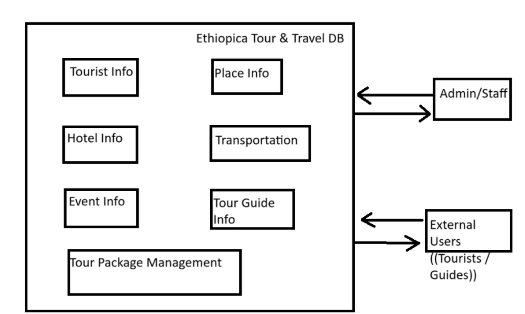

# System Definition - Ethiopica Tour and Travel Services Database

## **System Overview**
The Ethiopica Tour and Travel Services Database is a centralized system designed to manage information related to tourist activities, transportation, hotel accommodations, cultural events, tour guides, and tourists themselves.  
It aims to provide a smooth and well-organized travel experience for customers while improving the internal management and service efficiency of the company.

---

## **Purpose of the System**
- To store, organize, and manage essential information about tourist destinations, hotels, transportation options, and cultural events across Ethiopia.
- To help tourists easily access information and make informed decisions about their travel plans.
- To assist the company staff in managing tours, assigning resources, and tracking service usage.
- To automate and simplify manual administrative tasks related to tourism services.

---

## **Scope of the System**
- **Tourist Information Management**: Register and manage tourists’ personal details and preferences.
- **Place Management**: Maintain records of historical, cultural, and natural places available for visit.
- **Transportation Management**: Handle details of available vehicles, types, and travel schedules.
- **Hotel Management**: Provide information on hotel partners, available rooms, and hotel facilities.
- **Tour Package Management**: Create customizable tour packages based on destinations, transportation, and accommodation options.
- **Event Management**: Record and manage cultural or traditional events that tourists might attend.
- **Tour Guide Management**: Manage information about tour guides including contact details, specialization, and availability.

---

## **System Users**
- **Tourists**: Access information and choose services.
- **Tour Guides**: Manage assigned tours and schedules.
- **Company Staff/Admin**: Update data, manage operations, and monitor service usage.

---

## **System Boundaries**

- The system will **NOT** handle real-time booking or financial transactions directly.
- The system will **focus mainly on information management**, not on full online service integration (like full hotel bookings or transportation reservations).

---
